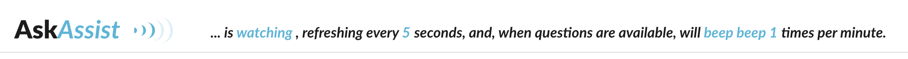

---
AskAssist is a small chrome plugin to complement the AskBCS slack application
and comes with the following features...

**Automated Refresh:** The user may define a number of seconds to wait between refreshes.  When the elapsed time has completed the plugin will simulate the clicking of the refresh button within the AskBCS Application.

**Sound Alerts:**  Whenever a new question is available ( tested by the presence of 'available questions' in the html ), AskAssist will play an alert sound. The user can toggle between several sound options as well as set the volume and frequency of the alert.  
 

## Installation
This is an unpacked work in progress.  To install the plugin enable developer mode in the upper right hand corner of `chrome://extensions` and then 'load unpacked' on the left. Once you have loaded the AskAssist folder the plugin will be ready to use. 

## Usage
**Remember**: AskAssist can only check for new questions while you have the page queue loaded in your browser.

When the user opens the page the automated refresh will be turned off. Clicking the word "waiting" on the right will begin the script and reveal the options.

When the script is running its refresh the following options may be adjusted...

### Clickables...
**watching:** toggles the script back off.

**alert:** will cycle through available sound files.

**volume**: will cycle through volume settings. This button is represented by the 5 vertical bars to the right of the AskAssist logo.

### Editables...
These options are content editable fields which accept only numbers up to 3 digits.

**refresh frequency:** determines the interval in seconds between refreshes.  

**alert frequency:** the maximum number of times per minute an alert will play. 

---

## Updating
If you have been using AskAssist and wish to update to the newest version simply use `git pull` and then reload the package in chrome.  There is a circular arrow in chrome extension management that reloads the package files.  After you have updated the plugin it is a good idea to clear your local storage as I currently have no validation for the settings and old settings on new versions may cause hiccups.

## Troubleshooting
**AskAssist is not appearing on the page**
Ensure that you have the most current version of AskAssist by following the Update instructions above.

**I get an alert message 'AskAssist cannot append to .p-workspace__primary_view_contents; element not found.'**
Previously, the script would sometimes fail to append to the page due to our slack bot loading after the slack page itself finishes the 'load' event.  In the past, this would occasionally cause the append to fail and require a refresh. I have updated the script to now search for that element recursively every 2 seconds until it loads OR until it fails to find the element after 40 seconds of searching. If you are getting this message it means that your AskAssist has been updated to include this change, yet is still unable to find the toolbar.  I have yet to see this happen, however, if you are getting this, please send me a slack message so that I can get to the bottom of it :) 

